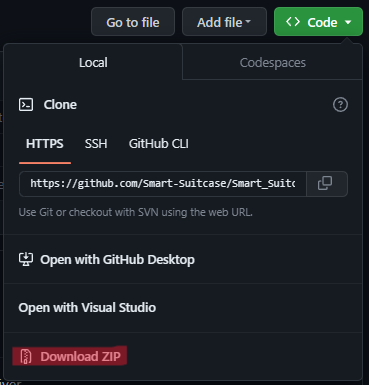
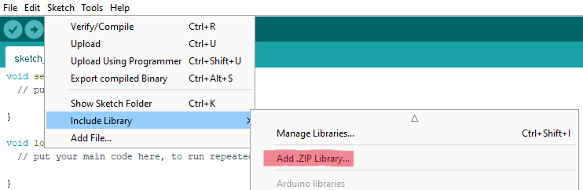
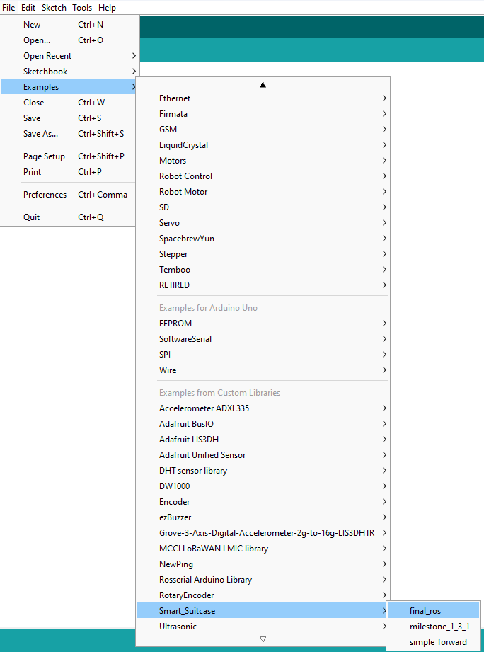

# Motors

This is an Arduino library to control two motors using a L298N driver.

## Installation
To install this library, download the zip-file from this Github page (*Code > Local > Download ZIP*). 
 
 
 
 
Then in the Arduino IDE go to *Sketch > Include Library > Add .ZIP Library...* 
 
 
 
And then select the downloaded zip-file. 
 
## Our code
To upload our code to an Arduino, go to *File > Examples > Smart_Suitcase > final_ros*. 
 
 
 
This is the final code we used for our autonomous suitcase robot.