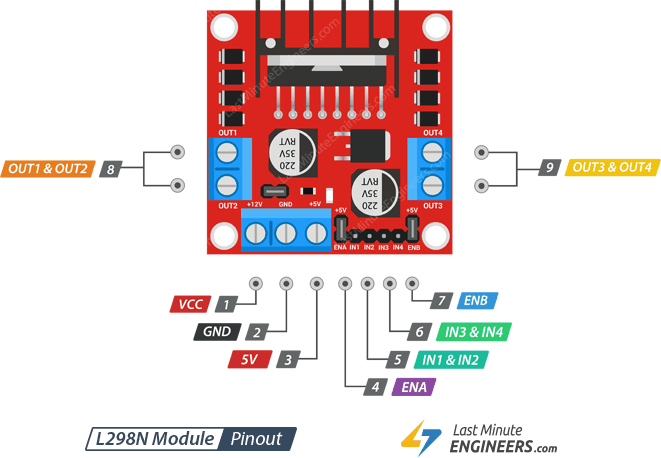

# Motors

This is an Arduino library to control two motors using a L298N driver.

## Installation
To install this library, download the zip-file from this Github page (*Code > Local > Download ZIP*). 
 
 
 
 
Then in the Arduino IDE go to *Sketch > Include Library > Add .ZIP Library...* 
 
 
 
And then select the downloaded zip-file. 
 
## Wiring
 
- Hook up one motor to the Out1 & Out2 pins and the second motor to the Out3 & out4 pins.
- Hook up your 12V power supply to Vcc and GND.
- Connect the ENA & ENB and IN1 -> IN4 pins to the Arduino. The pins you choose to use must match the ones declared at the top of the Arduino code. ***IMPORTANT***: the ENA and ENB pins MUST be connected to an ***analogue*** Arduino pin.
## Our code
To upload our code to an Arduino, go to *File > Examples > Smart_Suitcase > final_ros*. 
 
 
 
This is the final code we used for our autonomous suitcase robot.